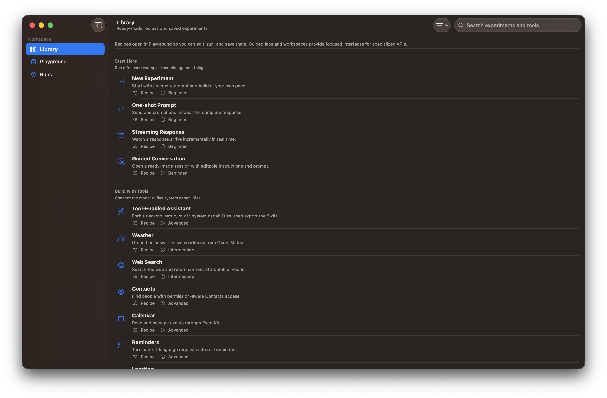
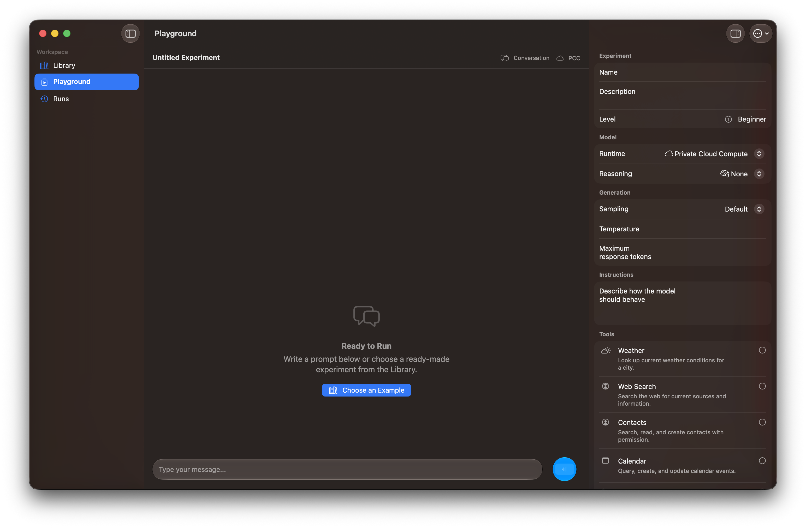
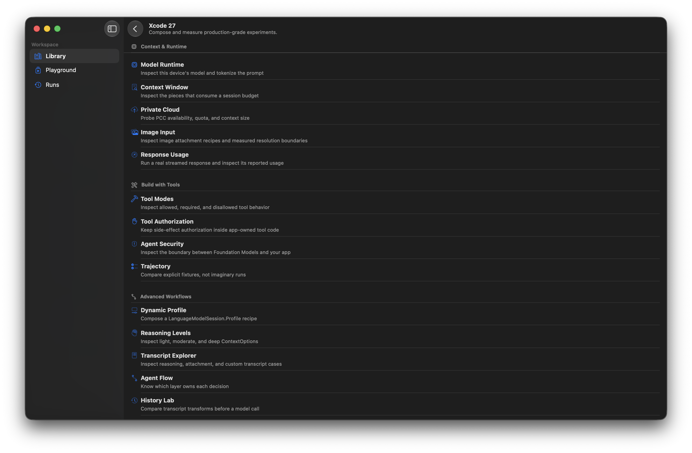

# Foundation Lab

Foundation Lab is a native iOS and macOS workbench for learning, testing, and
shipping with Apple's Foundation Models framework. It keeps the prompt,
configuration, tools, transcript, and run evidence in one place while still
providing focused labs for APIs that need a specialized interface.

The app is designed for two complementary workflows:

- Beginners can open a working recipe, change one thing, and run it immediately.
- Experienced developers can compose custom prompts and tools, inspect every run,
  compare adapters, and use the repository's CLI and evaluation tooling.

<div align="center">
  
  <br/>
  <strong>Library</strong>
  <br/>
  <br/>
  <table>
    <tr>
      <td align="center" style="padding: 15px;">
        
        <br/>
        <strong>Playground</strong>
      </td>
      <td align="center" style="padding: 15px;">
        
        <br/>
        <strong>Xcode 27 Workshop</strong>
      </td>
    </tr>
  </table>
</div>

## App Structure

Foundation Lab has three primary destinations:

| Destination | Purpose |
| --- | --- |
| Library | Browse 18 editable recipes, 14 guided labs, three workshops, saved experiments, and two expert workspaces. |
| Playground | Edit prompts and instructions, configure the model and tools, stream responses, use voice input, save experiments, and export Swift. |
| Runs | Inspect persisted run status, configuration, transcript events, tool calls, timing, and token usage. |

Library entries identify how they open:

- **Recipe** opens in Playground and can be edited, run, and saved.
- **Guided Lab** uses a focused interface for a specific Foundation Models API.
- **Workshop** groups related schema, language, or Xcode 27 examples without adding another top-level destination.
- **Workspace** opens an expert tool such as Adapter Comparison or FMFBench.

## Requirements

- iOS 26.0+ or macOS 26.0+
- Apple Silicon for on-device model execution
- Apple Intelligence enabled for live model runs
- Xcode 26.6 or Xcode 27

The project builds with both Xcode 26.6 and Xcode 27. APIs introduced with the
OS 27 SDK are compiler- and availability-gated, so the core app remains usable
with Xcode 26 while Xcode 27 exposes the newest labs.

## Getting Started

```bash
git clone https://github.com/rudrankriyam/Foundation-Models-Framework-Lab.git
cd Foundation-Models-Framework-Lab
open FoundationLab.xcodeproj
```

Build from the command line:

```bash
xcodebuild \
  -project FoundationLab.xcodeproj \
  -scheme 'Foundation Lab' \
  -destination 'generic/platform=macOS' \
  CODE_SIGNING_ALLOWED=NO \
  build

xcodebuild \
  -project FoundationLab.xcodeproj \
  -scheme 'Foundation Lab' \
  -destination 'generic/platform=iOS Simulator' \
  CODE_SIGNING_ALLOWED=NO \
  build
```

Live model execution requires a compatible physical device. Simulator builds
remain useful for compilation and interface validation.

## Capabilities

### Experiments and conversations

- Streaming multi-turn conversations with context-window management
- Editable instructions, sampling, response limits, runtime, and reasoning controls
- Saved experiment configurations and persistent run history
- Swift export for Playground configurations
- Speech recognition and synthesis integrated into Playground

### Built-in tools

Nine ready-made tool recipes use the shared `FoundationModelsTools` package:

- Weather through Open-Meteo
- Keyless Search1 web search
- Contacts
- Calendar
- Reminders
- Location and place search
- Authorized HealthKit data
- Apple Music
- Web metadata

Tool recipes open in Playground, where tools can be combined or removed. Tools
that can change user data require confirmation through the app-owned workflow.

### Structured output and applied projects

- `@Generable` models and `@Guide` constraints
- Dynamic schemas, nested objects, unions, forms, and invoice extraction
- Multilingual sessions and supported-language inspection
- RAG document indexing and semantic retrieval with LumoKit and VecturaKit
- A HealthKit dashboard and chat grounded only in authorized Health data

### Xcode 27 labs

When built with Xcode 27, Foundation Lab also demonstrates:

- `PrivateCloudComputeLanguageModel`
- Shared `LanguageModel` execution
- Image attachments and references
- Explicit tool-calling modes
- Dynamic profiles and reasoning controls
- Transcript inspection and history transforms
- Context-budget visualization
- Custom model executors, including a video-capable provider bridge

The image-input probe under [`Tools/ImageInputProbe`](Tools/ImageInputProbe)
can measure the current SDK's practical decoded-buffer boundary.

## Expert Workspaces

### Adapter Comparison

On macOS, import a `.fmadapter` package and run the same prompt through fresh
base-model and adapter sessions. The workspace shows both streams and diagnostic
time-to-first-token and total-duration measurements.

Training and export remain in the companion `fmas` CLI:

```bash
python3.11 -m venv .venv-fmas
source .venv-fmas/bin/activate
python -m pip install -e Tools/AdapterStudio
fmas init
fmas setup
fmas train-adapter --help
fmas export --help
```

See [`Tools/AdapterStudio`](Tools/AdapterStudio) for the full workflow.

### FMFBench

FMFBench is the repository's repeatable quality, agentic-tool, safety, and performance
suite. Its agentic corpus includes 25 deterministic cases covering multi-tool execution,
ambiguity, failures, duplicate prevention, and untrusted tool data.
The in-app workspace explains the protocol and artifacts. Canonical on-device Mac
results come from the CLI; PCC on Mac and all iPhone and iPad measurements use the
signed runner on physical Apple Intelligence hardware.

```bash
swift run fmfbench list
swift run fmfbench --suite quick --model on-device
swift run fmfbench --suite agentic --warmups 0 --repetitions 1
swift run fmfbench --suite full --warmups 5 --repetitions 20 \
  --json Tools/FMFBench/Results/run.json \
  --markdown Tools/FMFBench/Results/run.md
```

See [`Tools/FMFBench`](Tools/FMFBench) for workloads, methodology, graders, and
the device runner.

## Command-Line Interface

The `afm` CLI uses the same `FoundationLabCore` and `FoundationModelsKit`
runtime as the app.

```bash
brew tap rudrankriyam/tap
brew install afm

swift run afm --help
swift run afm model status
swift run afm token-count -i @instructions.md --prompt @prompt.md --breakdown
swift run afm session respond --prompt "Summarize Foundation Models."
```

See [`Tools/AFMCLI/README.md`](Tools/AFMCLI/README.md) for the command reference.
AFM releases use `afm-vx.y.z` tags so CLI releases remain independent from app releases.

## Repository Map

| Surface | Location | Purpose |
| --- | --- | --- |
| Foundation Lab | [`Foundation Lab`](Foundation%20Lab) | Native Library, Playground, Runs, guided labs, and expert workspaces |
| FoundationLabCore | [`FoundationLabCore`](FoundationLabCore) | UI-independent requests, results, use cases, providers, and experiment models |
| FoundationModelsKit | [`Packages/FoundationModelsKit`](Packages/FoundationModelsKit) | Transcript, context, history, and system-tool packages |
| AFM CLI | [`Tools/AFMCLI`](Tools/AFMCLI) | Scriptable Foundation Models workflows |
| FMFBench | [`Tools/FMFBench`](Tools/FMFBench) | Quality, agentic-tool, safety, and performance evaluation |
| Adapter tooling | [`Tools/AdapterStudio`](Tools/AdapterStudio) | Adapter training and export with `fmas` |
| Book playgrounds | [`BookPlaygrounds`](BookPlaygrounds) | Chapter-oriented `#Playground` examples |

The former standalone CLI, FMFBench, and Adapter Studio repositories are
archived in favor of this shared implementation.

## Swift Package Products

`FoundationModelsKit` and `FoundationModelsTools` are defined by
[`Packages/FoundationModelsKit/Package.swift`](Packages/FoundationModelsKit/Package.swift).
Local package consumers should depend on that package path directly rather than
requesting those products from the repository's root manifest.

- `FoundationModelsKit` provides transcript history transforms, provenance-aware
  token accounting shared by the app and CLI, calibrated estimation, and
  context-budget utilities.
- `FoundationModelsTools` provides calendar, contacts, health, location, music,
  reminders, weather, web search, and web metadata tools.
- `FoundationLabCore` provides the shared capability and experiment runtime.
- `FMFBenchCore` provides the evaluation corpus, graders, runner, metrics, and reports.
- `BenchmarkCore` remains as an FMFBench compatibility alias.
- `fmfbench` is the canonical benchmark executable.

## Localization and Permissions

The app ships English, German, Spanish, French, Italian, Japanese, Korean,
Portuguese (Brazil), Simplified Chinese, and Traditional Chinese localizations.

Features request permissions only when needed. Depending on the selected recipe
or lab, the app may request microphone, speech recognition, contacts, calendar,
reminders, location, HealthKit, or Apple Music access.

## Validation

```bash
swiftlint lint --strict --config .swiftlint.yml
swift test
```

CI additionally builds Foundation Lab for macOS and iOS Simulator and validates
the AFM, FMFBench, Adapter Studio, and TestFlight workflows.

## TestFlight

Join the Foundation Lab beta on
[TestFlight](https://testflight.apple.com/join/JWR9FpP3).

Pushes to `main` that affect the app can run the repository-local ASC workflow
in [`.asc/workflow.json`](.asc/workflow.json) through
[`foundation-lab-testflight.yml`](.github/workflows/foundation-lab-testflight.yml).

## Agent Skills

The repository includes two reusable skills:

- `foundation-models-app-builder` for production Foundation Models patterns
- `foundation-models-os27-updater` for Xcode 27 and OS 27 migrations

```bash
npx skills add rudrankriyam/Foundation-Models-Framework-Lab \
  --skill foundation-models-app-builder

npx skills add rudrankriyam/Foundation-Models-Framework-Lab \
  --skill foundation-models-os27-updater
```

## Contributing

Contributions are welcome. Please open an issue or pull request with a focused
change and include the relevant lint, test, and build results.

## License

Foundation Lab is available under the MIT License. See [LICENSE](LICENSE).
